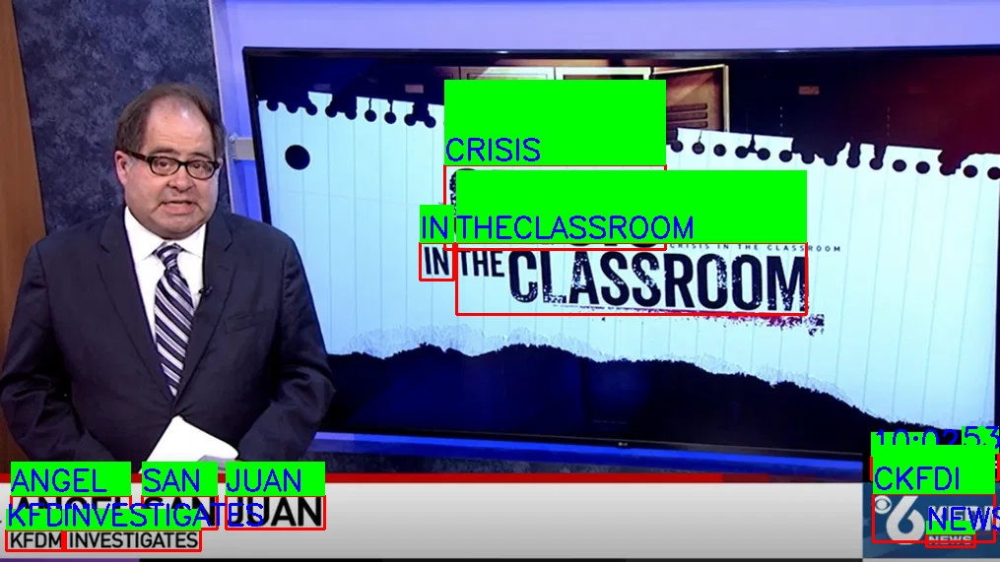
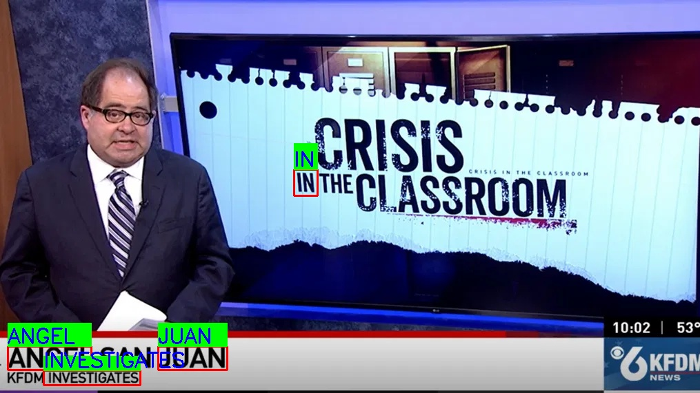
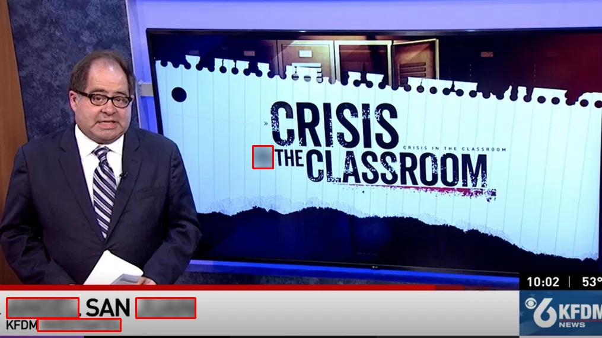

# Automatic Text Removal for Videos using Computer Vision

- Selectively censors all text appearing in a video that matches a vocabulary of filter texts.
- Uses [FAST](https://github.com/czczup/FAST) text segmenter and [PARSeq](https://github.com/baudm/parseq) text recognition model for text detection in frames.
- Users can set up sensitive words, such as names, (using the sensitive.csv) to censor in addition to [Surge AI](https://github.com/surge-ai/profanity) profanity text dataset.
- Processes videos and outputs at 45 frames per second on GTX 1080Ti GPU. With modern hardware, 60 fps is possible, ideal for all live streams like Live News, Youtube Live streams, etc.
- OpenCV is used to capture frames and apply a blur filter to flagged text regions.

## Example 1:
### Filter Words:
- Angel
- Juan
- in
- investigation
- ass

### Detection boxes:
Detects all the text in the frame

### Extracting Text from the detected text boxes:

### Flagging the text matching filter text:
Note: 'Classroom' correctly does not get flagged despite containing 'ass' because of levenstein distance algorithm to avoid false positives.

### Blurring the flagged text:

## Example 2:

Filter words:
- alligator
- robbery
- kindness
- parrot
- golf
- ttiki
  
Visualization:

https://drive.google.com/uc?export=download&id=1YVOmwUNnkEwKVZ_h-5iv38j7zzaWYbQT

Output:

https://drive.google.com/uc?export=download&id=1e1zSZpONvnYKs1SILQHvRuidrcvKIyJb
