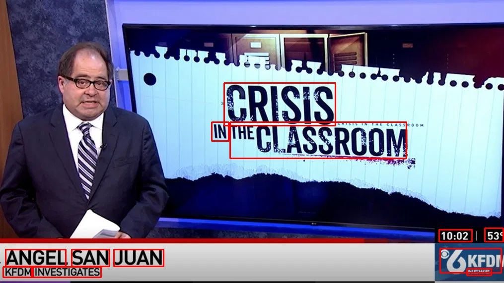

# Selective Text Removal for Videos using Computer Vision

- Selectively censors all text appearing in a video that matches a vocabulary of filter texts.
- Uses [FAST](https://github.com/czczup/FAST) text segmenter and [PARSeq](https://github.com/baudm/parseq) text recognition model for text detection in frames.
- Users can set up sensitive words, such as names, (using the sensitive.csv) to censor in addition to [Surge AI](https://github.com/surge-ai/profanity) profanity text dataset.
- OpenCV is used to capture frames and apply a blur filter to flagged text regions.

Example 1:
Filter Words:
- Angel
- Juan
- in
- investigation
- ass

Detection boxes:

Example 2:

Filter words:
- alligator
- robbery
- kindness
- parrot
- golf
- ttiki
  
Visualization:

https://drive.google.com/uc?export=download&id=1YVOmwUNnkEwKVZ_h-5iv38j7zzaWYbQT

Output:

https://drive.google.com/uc?export=download&id=1e1zSZpONvnYKs1SILQHvRuidrcvKIyJb
